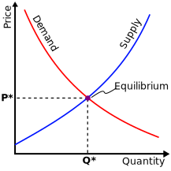
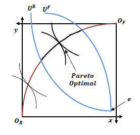
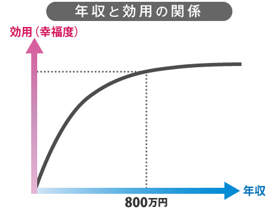
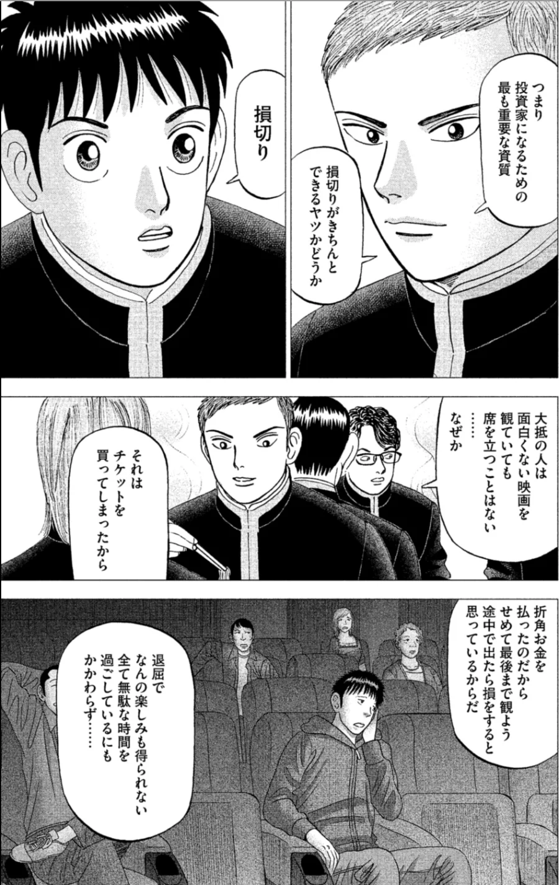
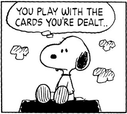

## 経済合理的な選択とは？
### 〜経済学を学ぶ〜
大阪学院大学経済学部  岡野光洋

***

## 経済って何？

(下にスクロールします)

---

- 消費税が10%に！
- 貿易戦争？
- 大企業の倒産？
- 株価の暴落？
- 仮想通貨？
- ブラックバイト？

色々ありすぎて分からない…

---

> "経済とは、人間の営みのことである。"

池上(2013)

---

だから、経済は難しい。

難しいからこそ、面白い。

***

### 今日のテーマ
- - -

- 経済とは・経済学とは
- なぜ経済学を学ぶのか
- 経済合理的な考え方(一例)

***

経済学とは、人々が幸せになるための学問である。

---

### 経済学における「問い」
- - -

人々が幸せになるために…

- 社会は何を生み出すべきか？
- それをどうやって生み出すのか？
- 生み出されたものを誰が消費するのか？

テイラー(2013)

---

なぜ経済学が必要なのか？

---

- 必要な資源（人、モノ、土地、時間、空間）は有限だから。
  - → 経済学を使って効率的に配分する。(efficiency)

- 一方を追求すれば、他方を犠牲にせざるを得ない
  - → 経済学を使って公平・平等に分配する。(equity)

---

  

_"誰かの願いが叶うころ　あの子が泣いてるよ  
  みんなの願いは同時には叶わない"_

出典: http://j-lyric.net/artist/a001c7c/l0025f4.html

---

### 効率的な配分の1つの解:

- 市場取引(需要と供給)にまかせる
- 価格が上下して、うまくいくことが多い(見えざる手)

(出典) wikimedia

---

### 公平な分配の1つの解:

1. 「誰も傷つけずに誰かが幸せになれる方法」を採用。
2. これ以上誰も、他の誰かを傷つけることなしには幸せにはなれない状態になったとき、それを最適とみなす。

(出典) wikimedia

***
***

### 経済学とは

有限の資源を有効に活用するための学問

- _"さまざまな人や組織などが市場でモノやお金を交換しあう行動を、ある仮説をもとにモデル化し、シンプルかつ理論的に説明しようとする学問"_ （井堀，2018）

- 制約付きの最大化問題を解いて分析する学問（井堀，2018）

---

### 資源配分の最適化

|     | 限られた資源 | 目的|
------|-------- |---|
| 個人 | 時間・健康な体| 幸せに生きる|
| 企業 | ヒト・モノ・カネ | 利潤の追求|
| 政府 | 税金 | 貧困や格差をなくす| |

***
***

何が幸福をもたらすか？

---

- _"高い給料を稼いだり、大きな家を買ったりするために私たちは一生懸命に頑張るが、思っていたほど幸せにはなれない。_
- _"とても幸福な人たちは、他の人たちと時間を過ごしている。友人や家族と過ごす時間を優先し、バリスタと話をする時間を作る人さえいる"_

ローリー・サントス

---

### 幸福をもたらすもの

1. 社会との関わり
2. 運動、瞑想
3. 十分な睡眠

参考:[ロイター](https://jp.reuters.com/article/happiness-idJPKBN1H50L8)

[(ショートムービーはこちら)](https://www.reuters.com/video/?videoId=OV891ZVSD&jwsource=cl)

---

_"お金は幸福になるもっとも確実な方法"_  
[幸福の「資本」論 | ダイヤモンド・オンライン](https://diamond.jp/articles/-/141130)

---

### お金は不安を解消する

- 老後不安・介護不安
- 事故や病気に対する備え
- 雇用不安、転職への不安

---

### 経済的独立とは

"働かなくても行きていける立場になること" (橘, 2013)
→ 「本当にやりたいこと」に挑戦できる。

経済的独立 ≠ お金持ち

老後までにこの状態を目指そう。

***
***

### 経済学は「選択の科学」
- - -

「資源配分」 ＝ 「選択肢から何かを選びとること」

何かを選び取ると、他の全ての可能性が消滅する。

---

人生は選択の連続である。

---

しかし、選択は難しい。

- 正解は存在しない。
- 正解は時代とともに変わる。
- やってみなければ分からない。 

---

経済学を知ると、選択のミスを減らすことができる。
(大江, 2015)

***
***

- 行列に何時間でも並びますか？
- 「1円でも安く」にこだわりますか？

---

- 「並ぶ時間を他に使えないか？」
- 「節約に手間暇かける価値はあるか？」

---

それをしなければ、

- 他に何ができたか？
- いくら稼げたか？
- 何を諦めずにすんだか？

= 機会費用

---

_"「何千円の収入を犠牲にしても、どうしても昼寝をしたかったから昼寝をした」、という理解をするわけです。「コストとベネフィットを比較して、ベネフィットの方が大きいと判断したから昼寝を選択したのだろう」というわけです"_

塚崎 （2016）

---

_"学園祭でヤキトリを売って10人で3000円の利益があったとします。300円ずつ山分けして喜んでいる学生がいますが、「学園祭に参加しないでアルバイトしていたら何万円になったのだろう？」と聞くと、がっかりします"_

塚崎 （2016）

***
***

映画がつまらなかったら、途中で帰りますか？

---

_"大抵の人は面白くない映画を観ていても席を立つことはない……。なぜか。それはチケットを買ってしまったから。 (略) 退屈でなんの楽しみも得られない全て無駄な時間を過ごしているにもかかわらず……。"_

  

「インベスターZ」2巻

---

最後まで見ても、見なくても、

- かけたお金は返ってこない
- かけた時間も返ってこない

= 埋没費用

---

_"店の料理がマズかったら、何も食べずに出て、家でお茶漬けを食べれば良いのです。入場料の3000円は、戻って来ないのですから (略) マズい店で定価2000円の食事を2つ食べるくらいなら、家のお茶漬けをたべて「3000円の出費と普通の思い」をした方が幸せでしょう"_

塚崎 （2016）

***

### 選択の極意

- 考えるべきコスト = 機会費用
- 考えてはならないコスト = 埋没費用

大江(2015)

***

### メッセージ

- 常識は真実とは限らない
  - 親の常識は30年前の常識(!)
  - みんなと同じではお金持ちにはなれない

- 教養を身につけよう
  - 私たちはどこから来て、どこへいくのか？(池上, 2014)
  - 大学は教養を身につける場所。

- 大学で勉強しよう！
  - 自分の人生を豊かなものに。

---

_"配られたカードで勝負するしかないのさ"_

スヌーピー

***
***

### 参考文献

- [池上彰(2013)「池上彰のやさしい経済学(1) しくみがわかる」日経ビジネス人文庫．](https://www.amazon.co.jp/dp/4532197104)
- [池上彰(2014)「おとなの教養」ＮＨＫ出版．](https://www.amazon.co.jp/dp/4140884312/)
- [井堀利宏（2018）『大学4年間の経済学が10時間でざっと学べる』角川文庫．](https://www.amazon.co.jp/dp/4046040572/)
- [大江英樹(2015)「経済とおかね超基本1年生」東洋経済新報社．](https://www.amazon.co.jp/dp/4492314652/)
- [橘玲(2013)『知的幸福の技術』幻冬舎．](https://www.amazon.co.jp/dp/B00DH87QIG/)

---

-  [塚崎公義 （2016a）「“機会費用”から読み解く黒字で閉店する企業の合理性」](http://wedge.ismedia.jp/articles/-/7276)
-  [塚崎公義 （2016b）「大食い客ばかりでもビュッフェ式レストランが潰れないワケ」](http://wedge.ismedia.jp/articles/-/7277)
-  [ティモシー・テイラー(2013)『スタンフォード大学で一番人気の経済学入門　ミクロ編』かんき出版．](https://www.amazon.co.jp/dp/B00E3J1T0O/)
-  [三田紀房(2013)『インベスターZ(2)』 コルク.](https://www.amazon.co.jp/gp/product/B00H7OSZYA)

